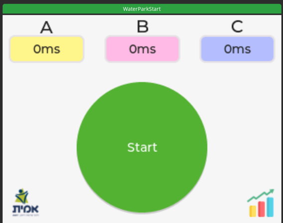
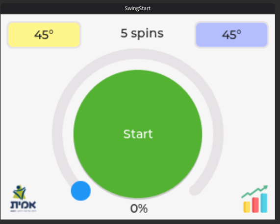
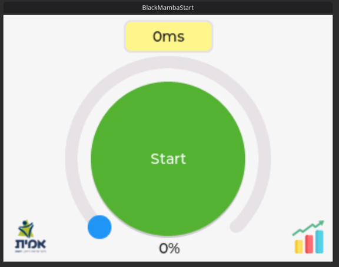
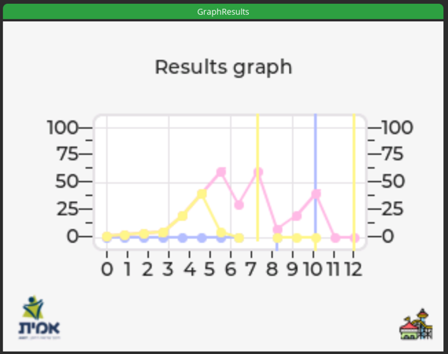

> Code of Conduct for adding expressions.

WE ONLY ACCEPT `unique_ptr<Expression\>`

This is because the process goes as follows:

1. Chars are parsed into "tokens"
2. Tokens are parsed into expressions creating our AST.
3. Expressions are run in sequence running all internal expressions.

<h1> ValueHoldExpression vs Copying</h1>

ValueHoldExpression - Used for objects / anything that is shared_ptr.

Copy - Used for basic data types like integers where we just copy the object.

> AST and variables:
> The abstract syntax tree is built up of raw "expressions", meaning nothing is interpreted until it's interpreted.

