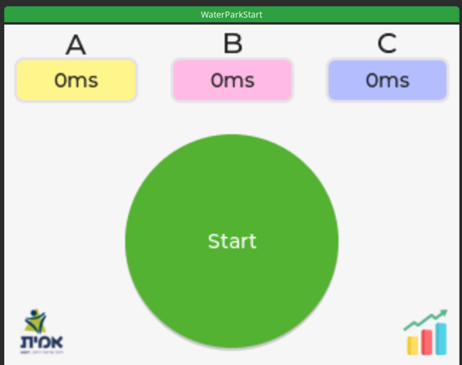
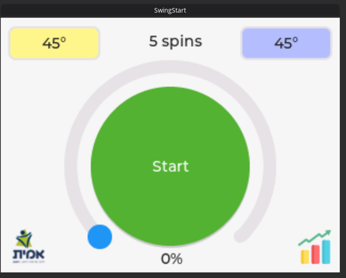
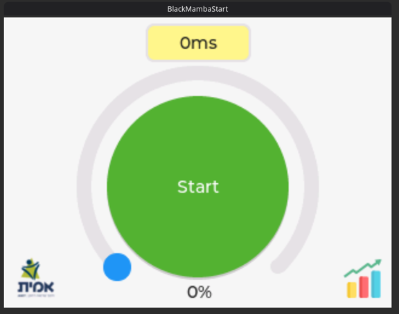
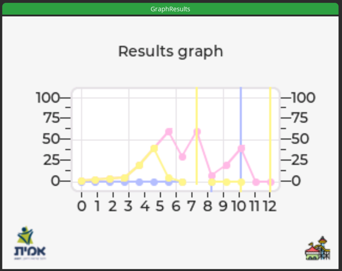

# Phisiland ESP32 Interpreter

[](https://wakatime.com/badge/github/shmezi/PhisilandInterpreter)
[](https://wakatime.com/badge/github/shmezi/Phisiterpeter-ESP32)
[](https://wakatime.com/badge/github/shmezi/PhisilandDisplay)
[](https://wakatime.com/badge/github/shmezi/PhisilandFlashTool)

[Flash your ESP-32 here](https://phisiland.ezra.lol/)
A custom scripting language interpreter built in C++ and deployed on the ESP32-S3. Code is fetched over Wi-Fi from a
Dovetail hub and executed directly on the device, with a FreeRTOS task loop driving reactive and time-based behaviors.

---

## How It Works

1. **Tokenization** — Raw source code is scanned character by character by `Tokenizer`, producing a flat list of `Token`
   objects classified as numbers, text, booleans, keywords, code blocks, or comments.
2. **Interpretation** — `Interpreter` walks the token list and builds an Abstract Syntax Tree (AST) of `Expression`
   objects. Each keyword triggers a `Factory` which consumes look-ahead/look-behind tokens and produces the appropriate
   expression node.
3. **Execution** — `Interpreter::run()` walks the AST top-to-bottom, calling `interpret()` on each expression. Reactive
   expressions (`when`, `once`, `reactOn`) register callbacks into the `ScheduleLoop` rather than blocking.

---

## Architecture

### `base/`

| File                  | Purpose                                                                                                                                                              |
|-----------------------|----------------------------------------------------------------------------------------------------------------------------------------------------------------------|
| `Tokenizer`           | Scans source code into tokens. Handles string literals (`"`), comments (`#`), operators, and newlines.                                                               |
| `Token` / `TokenType` | Represents a single lexed unit with a type (`NUMBER`, `TEXT`, `BOOL`, `KEYWORD`, etc.) and line number for error reporting.                                          |
| `Interpreter`         | Builds the AST from tokens and executes it. Registers all built-in factories into the head scope on startup.                                                         |
| `Scope`               | Hierarchical variable store. Variables walk up the parent chain for lookup. Also holds the keyword/factory registry.                                                 |
| `ScheduleLoop`        | FreeRTOS-driven event loop. Manages always-running tasks, cooldown tasks, conditional tasks, delayed tasks, and hardware interrupt callbacks.                        |
| `DovetailCore`        | Handles Wi-Fi connection, scanning for Dovetail-prefixed networks, joining them, fetching code from the hub over HTTP, and exposing `/event` and `/reset` endpoints. |

---

### `expressions/`

Every node in the AST is a subclass of `Expression`. Calling `interpret(scope)` evaluates the node and returns a
`shared_ptr<Expression>` result.

**Memory model:**

- `unique_ptr<Expression>` — used in the AST. Owned, not shared.
- `ValueHoldExpression` — wraps a `shared_ptr<Expression>` for objects that need to persist and be referenced (motors,
  gyros, lists). Use this instead of copying when your expression represents a stateful hardware object.
- Copy — used for primitive values (`NumberExpression`, `BooleanExpression`, `TextExpression`) which are cheap to copy.

#### Value Expressions

| Expression           | Description                                                                       |
|----------------------|-----------------------------------------------------------------------------------|
| `NumberExpression`   | Float value. Supports `+`, `-`, `*`, `/`, `==`, `!=`, `<`, `>`, and `to` (range). |
| `TextExpression`     | String literal. Supports `+` for concatenation.                                   |
| `BooleanExpression`  | `true`/`false`. Supports `and`, `or`, `not`.                                      |
| `FloatyText`         | An unresolved identifier — looks itself up in the scope at interpret time.        |
| `ListExpression`     | A mutable ordered list of expressions.                                            |
| `IntRangeExpression` | A start..end integer range produced by the `to` operator.                         |

#### Control Expressions

| Expression                               | Description                                                                                                                |
|------------------------------------------|----------------------------------------------------------------------------------------------------------------------------|
| `SetExpression` (`=`)                    | Assigns a value to a variable in the nearest enclosing scope that owns it, or creates it in the current scope.             |
| `CodeblockExpression` (`{ }`)            | A sequence of expressions run in a child scope. Returns the first `ReturnValue` it encounters.                             |
| `ClarificationBracketExpression` (`( )`) | Groups expressions; evaluates all but returns the first. Used for operator grouping and function argument lists.           |
| `IfExpression`                           | Evaluates a boolean condition and runs a codeblock if true.                                                                |
| `WhileExpression`                        | Loops a codeblock while a boolean condition holds.                                                                         |
| `WhenExpression`                         | Registers a conditional task in the `ScheduleLoop` — runs the codeblock every loop tick where the condition is true.       |
| `OnceExpression`                         | Like `when`, but the codeblock only fires on the first truthy edge (resets when condition goes false).                     |
| `AfterExpression`                        | Schedules a codeblock to run once after a given millisecond delay.                                                         |
| `ReturnExpression`                       | Wraps a value in a `ReturnValue` sentinel so `CodeblockExpression` can propagate it upward.                                |
| `ValueHoldExpression`                    | Holds a `shared_ptr` to an expression, allowing stateful objects to be stored in variables and referenced without copying. |

#### Arithmetic & Logic Expressions

`AdditionExpression`, `SubtractionExpression`, `MultiplicationExpression`, `DivisionExpression`, `EqualsExpression`,
`UnEqualExpression`, `GreaterExpression`, `LesserExpression`, `AbsExpression`, `AndExpression`, `OrExpression`,
`NotExpression`, `RangeOperatorExpression`

All binary operators take one look-behind and one look-ahead argument (`indexStart = -1, paramSize = 2`).

#### Hardware / Game Expressions

| Expression                                          | Token         | Description                                                                                                             |
|-----------------------------------------------------|---------------|-------------------------------------------------------------------------------------------------------------------------|
| `WriteExpression`                                   | `write`       | Sets a GPIO pin high or low.                                                                                            |
| `DigitalReadExpression`                             | `read`        | Reads a GPIO pin as boolean. Configures the pin as input with pull-up on first call.                                    |
| `AnalogReadExpression`                              | `analog`      | Reads an ADC channel with 100-sample rolling average.                                                                   |
| `ServoExpression`                                   | `servo`       | Controls a servo motor via MCPWM (0–180 degrees).                                                                       |
| `MotorExpression`                                   | `motor`       | DC motor with MCPWM speed/direction control and quadrature encoder tracking.                                            |
| `MoveExpression`                                    | `move`        | Sets a motor's speed (-100 to 100).                                                                                     |
| `RotateMotorByExpression`                           | `rotate`      | Rotates a motor to a target rotation count at a given speed, then stops.                                                |
| `RotationsExpression`                               | `rotations`   | Returns a motor's current rotation count (encoder ticks / 330).                                                         |
| `DegreesExpression`                                 | `degrees`     | Returns a motor's angle in degrees (wraps 0–360).                                                                       |
| `ResetRotationsExpression` / `ClearCountExpression` | `reset`       | Zeroes a motor's rotation counter.                                                                                      |
| `GyroScopeSensorExpression`                         | `gyro`        | Initializes an MPU-6050 over I2C and exposes pitch/roll.                                                                |
| `AngleExpression`                                   | `angle`       | Returns pitch from a gyro sensor.                                                                                       |
| `StatusLEDExpression`                               | `status`      | Sets the onboard WS2812 RGB LED to an R, G, B value.                                                                    |
| `InterruptPinExpression`                            | `reactOn`     | Attaches a GPIO falling-edge ISR; queues a `ScheduleLoop` ID task on each trigger, passing `exactTime` (µs) into scope. |
| `OnEventExpression`                                 | `on`          | Registers a named event handler called by `DovetailCore` when the hub sends a `/event?val=` request.                    |
| `SendResultExpression`                              | `sendResult`  | Sends a named value back to the hub via HTTP GET.                                                                       |
| `SetScreenExpression`                               | `screen`      | Tells the hub to switch to a named screen.                                                                              |
| `EndActivityExpression`                             | `endActivity` | Signals the hub that the current activity is complete.                                                                  |
| `CurrentTimeExpression`                             | `now`         | Returns the ESP32 timer value in microseconds.                                                                          |
| `Wrap360Expression`                                 | `wrap360`     | Normalizes an angle into the 0–360 range (reversed).                                                                    |

#### Internal Expressions

| Expression                                       | Description                                                                                                                                |
|--------------------------------------------------|--------------------------------------------------------------------------------------------------------------------------------------------|
| `DynamicExpression`                              | A user-defined function call. Maps argument names to values in a child scope and runs the captured codeblock.                              |
| `ReturnValue`                                    | Sentinel wrapper propagated up through `CodeblockExpression` to deliver a function's return value.                                         |
| `StartExpression` (`ise`)                        | Marker pushed before a delimited block so the interpreter knows where to stop collecting arguments.                                        |
| `DummyExpression` (`ide`)                        | No-op placeholder returned by factory `generate()` calls that register side effects (e.g. `fn` definitions) rather than producing a value. |
| `VoidExpression`                                 | Returned by expressions that have no meaningful value (assignments, writes, etc.).                                                         |
| `ExceptionExpression` / `NoDeclarationException` | Runtime error nodes that print a colored diagnostic and return void.                                                                       |

---

### `factories/`

Each `Factory` maps a start token to an expression constructor. The interpreter calls `indexStart()` and `paramSize()`
to determine how many tokens before and after the keyword to consume.

`FunctionExpressionFactory` (`fn`) is special: it reads a name, a parameter list `( )`, and a codeblock `{ }`, then
registers a new `DynamicExpressionFactory` into the current scope — making user-defined functions first-class keywords.

---

## Status LED Color Codes

The onboard LED reflects the interpreter's current state:

| Color      | State                     |
|------------|---------------------------|
| White      | Startup                   |
| Cyan       | Wi-Fi initialized         |
| Grey (dim) | Scanning for networks     |
| Azure      | Joined a Dovetail network |
| Magenta    | Code loaded               |
| Blue       | Tokenizing                |
| Purple     | Building AST              |
| Green      | Running                   |
| Red        | General error             |
| Pink-Red   | Token/parse error         |
| Orange     | Runtime error             |
| Yellow     | Warning                   |

---

## Contributing — Adding Expressions

**Only `unique_ptr<Expression>` is accepted in the AST.**

To add a new expression:

1. Create a header in `include/expressions/` and an implementation in `src/expressions/`.
2. Subclass `Expression` and implement `expressionName()` and `interpret(shared_ptr<Scope>)`.
3. Create a matching `Factory` in `include/factories/` / `src/factories/` that returns the expression from `generate()`.
4. Register the factory in `Interpreter::registerFactories()`.

If your expression holds a stateful object that should survive across calls (a motor, sensor, list), wrap it in
`ValueHoldExpression` with a `shared_ptr`. For plain data types, just return a new copy.

---

## Project Structure

```
src/
  main.cpp                  # Entry point, GPIO/ADC init, DovetailCore boot
  base/                     # Core interpreter: Tokenizer, Interpreter, Scope, ScheduleLoop, DovetailCore
  expressions/              # All expression implementations
    action/arithmetic/      # Math and comparison operators
    action/bool/            # and, or, not
    action/control/         # if, while, when, once, after, set, return, codeblock
    action/list/            # List mutation (add, clear)
    game/functions/         # Hardware I/O, sensors, communication
    game/objects/           # Motor, gyroscope
    game/operators/         # Motor query expressions (rotations, angle, etc.)
    internal/               # DynamicExpression, ReturnValue, Void, sentinels
    value/                  # Number, Text, Boolean, FloatyText, List, IntRange
  factories/                # One Factory per expression type
include/                    # Headers mirroring src/ structure
sdContents/                 # Example scripts to load onto the device
```




